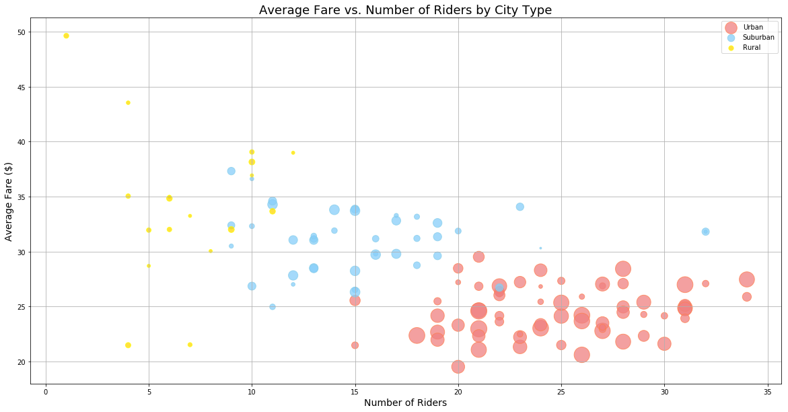
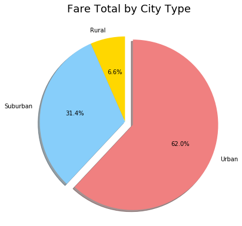
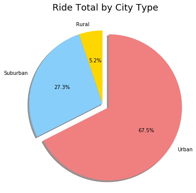
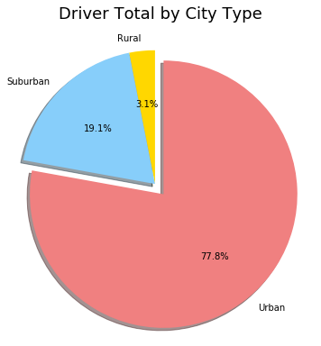

Rideshare Market Analysis
=========================

In this demonstration, I will offer data-backed guidance on new
opportunities for market differentiation for a fictional Uber
competitor.

In the input data folder in this repo lies the company's complete
recordset of ~2,400 rides. This contains information about every active
driver and historic ride, including details like city, driver count,
individual fares, and city type.

Also in the input data folder is a .csv containing information about
each of the 127 cities serviced by the company. For each city, there is
information on the number of drivers, as well as the city size.

The objective will be to build a Bubble Plot that showcases the
relationship between four key variables:

-  Average Fare ($) Per City
-  Total Number of Rides Per City
-  Total Number of Drivers Per City
-  City Type (Urban, Suburban, Rural)

In addition, we will produce the following three pie charts:

-  % of Total Fares by City Type
-  % of Total Rides by City Type
-  % of Total Drivers by City Type

As final considerations:

-  We will consider aesthetics and proper labelling of plots and pie
   charts.
-  We will stick to the company color scheme (Gold, Light Sky Blue, and
   Light Coral) in producing the plot and pie charts.

Import Dependencies
-------------------

.. code:: ipython3

    import pandas as pd
    import numpy as np
    import matplotlib.pyplot as plt

.. code:: ipython3

    # Create dataframes from .csv files
    city_csv = pd.read_csv('input_data/city_data.csv')
    ride_csv = pd.read_csv('input_data/ride_data.csv')
    cities = pd.DataFrame(city_csv)
    rides = pd.DataFrame(ride_csv)

Explore ``.csv``\ s
-------------------

.. code:: ipython3

    cities.head()

.. raw:: html

    

    
    <table border="1" class="dataframe">
      <thead>
        <tr style="text-align: right;">
          <th></th>
          <th>city</th>
          <th>driver_count</th>
          <th>type</th>
        </tr>
      </thead>
      <tbody>
        <tr>
          <th>0</th>
          <td>Kelseyland</td>
          <td>63</td>
          <td>Urban</td>
        </tr>
        <tr>
          <th>1</th>
          <td>Nguyenbury</td>
          <td>8</td>
          <td>Urban</td>
        </tr>
        <tr>
          <th>2</th>
          <td>East Douglas</td>
          <td>12</td>
          <td>Urban</td>
        </tr>
        <tr>
          <th>3</th>
          <td>West Dawnfurt</td>
          <td>34</td>
          <td>Urban</td>
        </tr>
        <tr>
          <th>4</th>
          <td>Rodriguezburgh</td>
          <td>52</td>
          <td>Urban</td>
        </tr>
      </tbody>
    </table>
    

.. code:: ipython3

    cities.index

.. parsed-literal::

    RangeIndex(start=0, stop=126, step=1)

.. code:: ipython3

    cities.dtypes

.. parsed-literal::

    city            object
    driver_count     int64
    type            object
    dtype: object

.. code:: ipython3

    rides.head()

.. raw:: html

    

    
    <table border="1" class="dataframe">
      <thead>
        <tr style="text-align: right;">
          <th></th>
          <th>city</th>
          <th>date</th>
          <th>fare</th>
          <th>ride_id</th>
        </tr>
      </thead>
      <tbody>
        <tr>
          <th>0</th>
          <td>Sarabury</td>
          <td>2016-01-16 13:49:27</td>
          <td>38.35</td>
          <td>5403689035038</td>
        </tr>
        <tr>
          <th>1</th>
          <td>South Roy</td>
          <td>2016-01-02 18:42:34</td>
          <td>17.49</td>
          <td>4036272335942</td>
        </tr>
        <tr>
          <th>2</th>
          <td>Wiseborough</td>
          <td>2016-01-21 17:35:29</td>
          <td>44.18</td>
          <td>3645042422587</td>
        </tr>
        <tr>
          <th>3</th>
          <td>Spencertown</td>
          <td>2016-07-31 14:53:22</td>
          <td>6.87</td>
          <td>2242596575892</td>
        </tr>
        <tr>
          <th>4</th>
          <td>Nguyenbury</td>
          <td>2016-07-09 04:42:44</td>
          <td>6.28</td>
          <td>1543057793673</td>
        </tr>
      </tbody>
    </table>
    

.. code:: ipython3

    rides.index

.. parsed-literal::

    RangeIndex(start=0, stop=2375, step=1)

.. code:: ipython3

    rides.dtypes

.. parsed-literal::

    city        object
    date        object
    fare       float64
    ride_id      int64
    dtype: object

Create Summary Dataframe
------------------------

The first dataframe we have to create is the: - average fare ($) - total
number of rides - total number of drivers - type

For each city

Strategy:
~~~~~~~~~

The cities data already contains columns with the: - Total number of
drivers - City type

The rides data contains the information we will need to calculate the
remaining figures: - Average fare ($) - Total number of rides

So, we will use the rides data to create a dataframe with 3 columns: -
City - Average fare - Total rides

To accomplish this, we grouby city on the rides dataframe:

.. code:: ipython3

    ridegroup = rides.groupby('city')

Then we call out the column, and the summary method.

To prepare for later join, we turn the returned series into a dataframe,
and reset the index.

.. code:: ipython3

    avfarepercity = pd.DataFrame(ridegroup['fare'].mean()).reset_index()
    avfarepercity.head()

.. raw:: html

    

    
    <table border="1" class="dataframe">
      <thead>
        <tr style="text-align: right;">
          <th></th>
          <th>city</th>
          <th>fare</th>
        </tr>
      </thead>
      <tbody>
        <tr>
          <th>0</th>
          <td>Alvarezhaven</td>
          <td>23.928710</td>
        </tr>
        <tr>
          <th>1</th>
          <td>Alyssaberg</td>
          <td>20.609615</td>
        </tr>
        <tr>
          <th>2</th>
          <td>Anitamouth</td>
          <td>37.315556</td>
        </tr>
        <tr>
          <th>3</th>
          <td>Antoniomouth</td>
          <td>23.625000</td>
        </tr>
        <tr>
          <th>4</th>
          <td>Aprilchester</td>
          <td>21.981579</td>
        </tr>
      </tbody>
    </table>
    

We will do the same for total number of rides. Any column can be chosen,
and the .count() method will return the number of times each city
appears in the rides dataframe:

Again, to prepare for later join, we turn the returned series into a
dataframe, and reset the index.

.. code:: ipython3

    ridespercity = pd.DataFrame(ridegroup['fare'].count()).reset_index()
    ridespercity.head()

.. raw:: html

    

    
    <table border="1" class="dataframe">
      <thead>
        <tr style="text-align: right;">
          <th></th>
          <th>city</th>
          <th>fare</th>
        </tr>
      </thead>
      <tbody>
        <tr>
          <th>0</th>
          <td>Alvarezhaven</td>
          <td>31</td>
        </tr>
        <tr>
          <th>1</th>
          <td>Alyssaberg</td>
          <td>26</td>
        </tr>
        <tr>
          <th>2</th>
          <td>Anitamouth</td>
          <td>9</td>
        </tr>
        <tr>
          <th>3</th>
          <td>Antoniomouth</td>
          <td>22</td>
        </tr>
        <tr>
          <th>4</th>
          <td>Aprilchester</td>
          <td>19</td>
        </tr>
      </tbody>
    </table>
    

Now that we know how to produce the summaries, lets join them to the
city dataframe:

.. code:: ipython3

    first_summary = cities.merge(
        avfarepercity.merge(
            ridespercity,
            on='city', how='outer'), 
        on='city', how='outer')

Let's take a look at the result:

.. code:: ipython3

    first_summary.head()

.. raw:: html

    

    
    <table border="1" class="dataframe">
      <thead>
        <tr style="text-align: right;">
          <th></th>
          <th>city</th>
          <th>driver_count</th>
          <th>type</th>
          <th>fare_x</th>
          <th>fare_y</th>
        </tr>
      </thead>
      <tbody>
        <tr>
          <th>0</th>
          <td>Kelseyland</td>
          <td>63</td>
          <td>Urban</td>
          <td>21.806429</td>
          <td>28</td>
        </tr>
        <tr>
          <th>1</th>
          <td>Nguyenbury</td>
          <td>8</td>
          <td>Urban</td>
          <td>25.899615</td>
          <td>26</td>
        </tr>
        <tr>
          <th>2</th>
          <td>East Douglas</td>
          <td>12</td>
          <td>Urban</td>
          <td>26.169091</td>
          <td>22</td>
        </tr>
        <tr>
          <th>3</th>
          <td>West Dawnfurt</td>
          <td>34</td>
          <td>Urban</td>
          <td>22.330345</td>
          <td>29</td>
        </tr>
        <tr>
          <th>4</th>
          <td>Rodriguezburgh</td>
          <td>52</td>
          <td>Urban</td>
          <td>21.332609</td>
          <td>23</td>
        </tr>
      </tbody>
    </table>
    

Because of the name collision of 'fare', pandas added a suffix to each
instance of 'fare'.

Let's rename the columns for intelligibility.

.. code:: ipython3

    first_summary = first_summary.rename(columns={'fare_x':'average_fare',
                                                  'fare_y':'ride_count'})

.. code:: ipython3

    first_summary.head()

.. raw:: html

    

    
    <table border="1" class="dataframe">
      <thead>
        <tr style="text-align: right;">
          <th></th>
          <th>city</th>
          <th>driver_count</th>
          <th>type</th>
          <th>average_fare</th>
          <th>ride_count</th>
        </tr>
      </thead>
      <tbody>
        <tr>
          <th>0</th>
          <td>Kelseyland</td>
          <td>63</td>
          <td>Urban</td>
          <td>21.806429</td>
          <td>28</td>
        </tr>
        <tr>
          <th>1</th>
          <td>Nguyenbury</td>
          <td>8</td>
          <td>Urban</td>
          <td>25.899615</td>
          <td>26</td>
        </tr>
        <tr>
          <th>2</th>
          <td>East Douglas</td>
          <td>12</td>
          <td>Urban</td>
          <td>26.169091</td>
          <td>22</td>
        </tr>
        <tr>
          <th>3</th>
          <td>West Dawnfurt</td>
          <td>34</td>
          <td>Urban</td>
          <td>22.330345</td>
          <td>29</td>
        </tr>
        <tr>
          <th>4</th>
          <td>Rodriguezburgh</td>
          <td>52</td>
          <td>Urban</td>
          <td>21.332609</td>
          <td>23</td>
        </tr>
      </tbody>
    </table>
    

.. code:: ipython3

    first_summary.dtypes

.. parsed-literal::

    city             object
    driver_count      int64
    type             object
    average_fare    float64
    ride_count        int64
    dtype: object

Segment summary dataframe for plotting
--------------------------------------

Plotting strategy:
~~~~~~~~~~~~~~~~~~

Take a look at the four variables we have chosen to represent: - Average
Fare ($) Per City - Total Number of Rides Per City - Total Number of
Drivers Per City - City Type (Urban, Suburban, Rural)

Here we have three scalar variables, and one categorical variable.

The categorical variable is best represented by color in the bubble
plot. - In order to have three colors on our plot, my strategy is to
segment the above dataframe into three parts, one for each city type. -
I will then create 3 plots, each with a different color - plt.show() to
display

Size of the bubble will be represented by the driver count for each
city.

Of the other two scalar variables: - Rides per city will be the
independent variable. - Average fare will be the dependent variable.

First, segment the summary dataframe:
~~~~~~~~~~~~~~~~~~~~~~~~~~~~~~~~~~~~~

.. code:: ipython3

    typeurban = first_summary[first_summary['type'] == 'Urban']
    typesuburban = first_summary[first_summary['type'] == 'Suburban']
    typerural = first_summary[first_summary['type'] == 'Rural']

Plot:

.. code:: ipython3

    plt.figure(figsize=(20,10))
    # multiply all driver_count by 8 to make plot more readable
    plt.scatter(typeurban['ride_count'], typeurban['average_fare'], typeurban['driver_count'] * 8, c='lightcoral', label='Urban', alpha=0.75, edgecolor='coral')
    plt.scatter(typesuburban['ride_count'], typesuburban['average_fare'], typesuburban['driver_count'] * 8, c='lightskyblue', label='Suburban', alpha=0.75, edgecolor='skyblue')
    plt.scatter(typerural['ride_count'], typerural['average_fare'], typerural['driver_count'] * 8, c='gold', label='Rural', alpha=0.75, edgecolor='yellow')
    plt.legend()
    plt.xlabel('Number of Riders', size=14)
    plt.ylabel('Average Fare ($)', size=14)
    plt.title('Average Fare vs. Number of Riders by City Type', size=18)
    plt.grid()
    plt.show()

Pie Charts
----------

We now have three pie charts to create:

-  % of Total Fares by City Type
-  % of Total Rides by City Type
-  % of Total Drivers by City Type

Each requires us to group by city type, and sum: - Fares - Rides -
Drivers

Lets look at our summary dataframe again:

.. code:: ipython3

    first_summary.head()

.. raw:: html

    

    
    <table border="1" class="dataframe">
      <thead>
        <tr style="text-align: right;">
          <th></th>
          <th>city</th>
          <th>driver_count</th>
          <th>type</th>
          <th>average_fare</th>
          <th>ride_count</th>
        </tr>
      </thead>
      <tbody>
        <tr>
          <th>0</th>
          <td>Kelseyland</td>
          <td>63</td>
          <td>Urban</td>
          <td>21.806429</td>
          <td>28</td>
        </tr>
        <tr>
          <th>1</th>
          <td>Nguyenbury</td>
          <td>8</td>
          <td>Urban</td>
          <td>25.899615</td>
          <td>26</td>
        </tr>
        <tr>
          <th>2</th>
          <td>East Douglas</td>
          <td>12</td>
          <td>Urban</td>
          <td>26.169091</td>
          <td>22</td>
        </tr>
        <tr>
          <th>3</th>
          <td>West Dawnfurt</td>
          <td>34</td>
          <td>Urban</td>
          <td>22.330345</td>
          <td>29</td>
        </tr>
        <tr>
          <th>4</th>
          <td>Rodriguezburgh</td>
          <td>52</td>
          <td>Urban</td>
          <td>21.332609</td>
          <td>23</td>
        </tr>
      </tbody>
    </table>
    

All the information we need is there, except for total fare.

Lets derive a dataframe for total fare by city, and join it to this one:

.. code:: ipython3

    totfare = pd.DataFrame(ridegroup['fare'].sum()).reset_index()
    second_summary = first_summary.merge(totfare, on='city', how='outer')
    second_summary.head()

.. raw:: html

    

    
    <table border="1" class="dataframe">
      <thead>
        <tr style="text-align: right;">
          <th></th>
          <th>city</th>
          <th>driver_count</th>
          <th>type</th>
          <th>average_fare</th>
          <th>ride_count</th>
          <th>fare</th>
        </tr>
      </thead>
      <tbody>
        <tr>
          <th>0</th>
          <td>Kelseyland</td>
          <td>63</td>
          <td>Urban</td>
          <td>21.806429</td>
          <td>28</td>
          <td>610.58</td>
        </tr>
        <tr>
          <th>1</th>
          <td>Nguyenbury</td>
          <td>8</td>
          <td>Urban</td>
          <td>25.899615</td>
          <td>26</td>
          <td>673.39</td>
        </tr>
        <tr>
          <th>2</th>
          <td>East Douglas</td>
          <td>12</td>
          <td>Urban</td>
          <td>26.169091</td>
          <td>22</td>
          <td>575.72</td>
        </tr>
        <tr>
          <th>3</th>
          <td>West Dawnfurt</td>
          <td>34</td>
          <td>Urban</td>
          <td>22.330345</td>
          <td>29</td>
          <td>647.58</td>
        </tr>
        <tr>
          <th>4</th>
          <td>Rodriguezburgh</td>
          <td>52</td>
          <td>Urban</td>
          <td>21.332609</td>
          <td>23</td>
          <td>490.65</td>
        </tr>
      </tbody>
    </table>
    

Great, now lets clean this up by removing columns we don't need, as well
as renaming the new column for intelligibility:

.. code:: ipython3

    second_summary = second_summary[['type', 'fare', 'ride_count', 'driver_count']]
    second_summary = second_summary.rename(columns={'fare':'total_fare'})
    second_summary.head()

.. raw:: html

    

    
    <table border="1" class="dataframe">
      <thead>
        <tr style="text-align: right;">
          <th></th>
          <th>type</th>
          <th>total_fare</th>
          <th>ride_count</th>
          <th>driver_count</th>
        </tr>
      </thead>
      <tbody>
        <tr>
          <th>0</th>
          <td>Urban</td>
          <td>610.58</td>
          <td>28</td>
          <td>63</td>
        </tr>
        <tr>
          <th>1</th>
          <td>Urban</td>
          <td>673.39</td>
          <td>26</td>
          <td>8</td>
        </tr>
        <tr>
          <th>2</th>
          <td>Urban</td>
          <td>575.72</td>
          <td>22</td>
          <td>12</td>
        </tr>
        <tr>
          <th>3</th>
          <td>Urban</td>
          <td>647.58</td>
          <td>29</td>
          <td>34</td>
        </tr>
        <tr>
          <th>4</th>
          <td>Urban</td>
          <td>490.65</td>
          <td>23</td>
          <td>52</td>
        </tr>
      </tbody>
    </table>
    

Now we can groupby 'type' and get the total for each column:

.. code:: ipython3

    typegroup = second_summary.groupby('type')
    third_summary = pd.DataFrame(typegroup[['total_fare', 'ride_count', 'driver_count']].sum()).reset_index()
    third_summary

.. raw:: html

    

    
    <table border="1" class="dataframe">
      <thead>
        <tr style="text-align: right;">
          <th></th>
          <th>type</th>
          <th>total_fare</th>
          <th>ride_count</th>
          <th>driver_count</th>
        </tr>
      </thead>
      <tbody>
        <tr>
          <th>0</th>
          <td>Rural</td>
          <td>4255.09</td>
          <td>125</td>
          <td>104</td>
        </tr>
        <tr>
          <th>1</th>
          <td>Suburban</td>
          <td>20335.69</td>
          <td>657</td>
          <td>638</td>
        </tr>
        <tr>
          <th>2</th>
          <td>Urban</td>
          <td>40078.34</td>
          <td>1625</td>
          <td>2607</td>
        </tr>
      </tbody>
    </table>
    

All pie charts will have the 'type' column as labels, and each will have
one of the other columns as values:

.. code:: ipython3

    colors = ['gold', 'lightskyblue', 'lightcoral']
    explode = (0, 0, 0.1)
    plt.figure(figsize=(6,6))
    plt.pie(third_summary['total_fare'], labels=third_summary['type'], colors=colors, autopct='%1.1f%%', explode=explode, shadow=True, startangle=90)
    plt.axis('equal')
    plt.title('Fare Total by City Type\n', size=18)
    plt.show()

.. code:: ipython3

    colors = ['gold', 'lightskyblue', 'lightcoral']
    explode = (0, 0, 0.1)
    plt.figure(figsize=(6,6))
    plt.pie(third_summary['ride_count'], labels=third_summary['type'], colors=colors, autopct='%1.1f%%', explode=explode, shadow=True, startangle=90)
    plt.axis('equal')
    plt.title('Ride Total by City Type\n', size=18)
    plt.show()

.. code:: ipython3

    colors = ['gold', 'lightskyblue', 'lightcoral']
    explode = (0, 0, 0.1)
    plt.figure(figsize=(6,6))
    plt.pie(third_summary['driver_count'], labels=third_summary['type'], autopct='%1.1f%%', colors=colors, explode=explode, shadow=True, startangle=90)
    plt.axis('equal')
    plt.title('Driver Total by City Type\n', size=18)
    plt.show()

Conclusions:
~~~~~~~~~~~~

-  Urban cities have the greatest proportion of drivers, rides, and
   total fares.
-  As the number of riders in a city goes up, the average fare
   diminishes.
-  In rural cities, riders pay more than those in urban areas.
